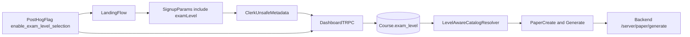

# Phased Plan: A-Level + AS-Level Support

## Goals
- Introduce a first-class exam-level domain (`a_level`, `as_level`) across frontend, backend, and persistence.
- Reuse your existing AS catalog file at [`/Users/chiso/Projects/Omnicentra/Exam Genius/exam-genius/libs/shared/utils/src/lib/as-level-subject-papers.json`](/Users/chiso/Projects/Omnicentra/Exam Genius/exam-genius/libs/shared/utils/src/lib/as-level-subject-papers.json).
- Roll out safely behind a PostHog feature flag (created via MCP), with server-side enforcement to prevent bypass.

## Current-State Anchors (what this plan is based on)
- Catalog currently comes from inline `SUBJECT_PAPERS` in [`/Users/chiso/Projects/Omnicentra/Exam Genius/exam-genius/libs/shared/utils/src/lib/shared-constants.ts`](/Users/chiso/Projects/Omnicentra/Exam Genius/exam-genius/libs/shared/utils/src/lib/shared-constants.ts).
- `as-level-subject-papers.json` is currently not wired into runtime usage.
- Course uniqueness and onboarding flows currently use `subject + exam_board` only:
  - [`/Users/chiso/Projects/Omnicentra/Exam Genius/exam-genius/apps/dashboard-app/src/server/api/routers/course.ts`](/Users/chiso/Projects/Omnicentra/Exam Genius/exam-genius/apps/dashboard-app/src/server/api/routers/course.ts)
  - [`/Users/chiso/Projects/Omnicentra/Exam Genius/exam-genius/apps/dashboard-app/src/server/handlers/clerk-webhook-handlers.ts`](/Users/chiso/Projects/Omnicentra/Exam Genius/exam-genius/apps/dashboard-app/src/server/handlers/clerk-webhook-handlers.ts)
- Backend generation/marking prompts are explicitly A-level:
  - [`/Users/chiso/Projects/Omnicentra/Exam Genius/exam-genius-backend/src/app/prompts/paper-generate.ts`](/Users/chiso/Projects/Omnicentra/Exam Genius/exam-genius-backend/src/app/prompts/paper-generate.ts)
  - [`/Users/chiso/Projects/Omnicentra/Exam Genius/exam-genius-backend/src/app/prompts/ai-marking.ts`](/Users/chiso/Projects/Omnicentra/Exam Genius/exam-genius-backend/src/app/prompts/ai-marking.ts)

## Architecture Direction
- Add explicit `ExamLevel` to domain model and APIs.
- Replace single-catalog assumption with level-aware catalog resolver.
- Use PostHog feature flag for progressive UI rollout; add server-side guardrails (tRPC + backend) so behavior cannot be spoofed.

## Phase 0: Flag + rollout scaffolding
1. Create PostHog feature flag via MCP (recommended key: `enable_exam_level_selection`, default OFF).
2. Add a small typed feature-flag access layer in dashboard and landing PostHog clients.
3. Add a server-side fallback kill switch env (for hard-disable regardless of client state).

Primary files:
- [`/Users/chiso/Projects/Omnicentra/Exam Genius/exam-genius/apps/dashboard-app/src/instrumentation-client.ts`](/Users/chiso/Projects/Omnicentra/Exam Genius/exam-genius/apps/dashboard-app/src/instrumentation-client.ts)
- [`/Users/chiso/Projects/Omnicentra/Exam Genius/exam-genius/apps/landing-page/instrumentation-client.ts`](/Users/chiso/Projects/Omnicentra/Exam Genius/exam-genius/apps/landing-page/instrumentation-client.ts)
- [`/Users/chiso/Projects/Omnicentra/Exam Genius/exam-genius/apps/dashboard-app/src/env.js`](/Users/chiso/Projects/Omnicentra/Exam Genius/exam-genius/apps/dashboard-app/src/env.js)

## Phase 1: Shared catalog + type system
1. Introduce shared `ExamLevel` type (e.g. `a_level | as_level`) and export helpers.
2. Wire both catalogs:
   - existing A-level source (inline or migrated to `a-level-subject-papers.json`)
   - new AS-level source from your JSON.
3. Add a resolver utility like `getSubjectPapersByLevel(level)` and keep legacy `SUBJECT_PAPERS` alias temporarily for backward compatibility.

Primary files:
- [`/Users/chiso/Projects/Omnicentra/Exam Genius/exam-genius/libs/shared/utils/src/lib/shared-types.ts`](/Users/chiso/Projects/Omnicentra/Exam Genius/exam-genius/libs/shared/utils/src/lib/shared-types.ts)
- [`/Users/chiso/Projects/Omnicentra/Exam Genius/exam-genius/libs/shared/utils/src/lib/shared-constants.ts`](/Users/chiso/Projects/Omnicentra/Exam Genius/exam-genius/libs/shared/utils/src/lib/shared-constants.ts)
- [`/Users/chiso/Projects/Omnicentra/Exam Genius/exam-genius/libs/shared/utils/src/lib/as-level-subject-papers.json`](/Users/chiso/Projects/Omnicentra/Exam Genius/exam-genius/libs/shared/utils/src/lib/as-level-subject-papers.json)
- [`/Users/chiso/Projects/Omnicentra/Exam Genius/exam-genius/libs/shared/utils/src/lib/a-level-subject-papers.json`](/Users/chiso/Projects/Omnicentra/Exam Genius/exam-genius/libs/shared/utils/src/lib/a-level-subject-papers.json)

## Phase 2: Persistence + API contracts
1. Add `exam_level` to `Course` (and optionally denormalize to `Paper` if needed for analytics/filtering).
2. Backfill existing data to `a_level`.
3. Update duplicate detection to `(subject, exam_board, exam_level)`.
4. Thread `exam_level` through signup params, Clerk metadata, Stripe metadata, and tRPC schemas.

Primary files (frontend repo):
- [`/Users/chiso/Projects/Omnicentra/Exam Genius/exam-genius/prisma/schemas/course.prisma`](/Users/chiso/Projects/Omnicentra/Exam Genius/exam-genius/prisma/schemas/course.prisma)
- [`/Users/chiso/Projects/Omnicentra/Exam Genius/exam-genius/apps/dashboard-app/src/server/api/routers/course.ts`](/Users/chiso/Projects/Omnicentra/Exam Genius/exam-genius/apps/dashboard-app/src/server/api/routers/course.ts)
- [`/Users/chiso/Projects/Omnicentra/Exam Genius/exam-genius/apps/dashboard-app/src/utils/signup-search-params.ts`](/Users/chiso/Projects/Omnicentra/Exam Genius/exam-genius/apps/dashboard-app/src/utils/signup-search-params.ts)
- [`/Users/chiso/Projects/Omnicentra/Exam Genius/exam-genius/apps/dashboard-app/src/app/signup/[[...signup]]/page.tsx`](/Users/chiso/Projects/Omnicentra/Exam Genius/exam-genius/apps/dashboard-app/src/app/signup/[[...signup]]/page.tsx)
- [`/Users/chiso/Projects/Omnicentra/Exam Genius/exam-genius/apps/dashboard-app/src/server/handlers/clerk-webhook-handlers.ts`](/Users/chiso/Projects/Omnicentra/Exam Genius/exam-genius/apps/dashboard-app/src/server/handlers/clerk-webhook-handlers.ts)
- [`/Users/chiso/Projects/Omnicentra/Exam Genius/exam-genius/apps/dashboard-app/src/server/api/routers/stripe.ts`](/Users/chiso/Projects/Omnicentra/Exam Genius/exam-genius/apps/dashboard-app/src/server/api/routers/stripe.ts)
- [`/Users/chiso/Projects/Omnicentra/Exam Genius/exam-genius/apps/dashboard-app/src/server/handlers/stripe-webhook-handlers.ts`](/Users/chiso/Projects/Omnicentra/Exam Genius/exam-genius/apps/dashboard-app/src/server/handlers/stripe-webhook-handlers.ts)
- [`/Users/chiso/Projects/Omnicentra/Exam Genius/exam-genius/apps/dashboard-app/src/utils/types.ts`](/Users/chiso/Projects/Omnicentra/Exam Genius/exam-genius/apps/dashboard-app/src/utils/types.ts)

Primary files (backend repo):
- [`/Users/chiso/Projects/Omnicentra/Exam Genius/exam-genius-backend/prisma/schemas/course.prisma`](/Users/chiso/Projects/Omnicentra/Exam Genius/exam-genius-backend/prisma/schemas/course.prisma)
- [`/Users/chiso/Projects/Omnicentra/Exam Genius/exam-genius-backend/prisma/schemas/paper.prisma`](/Users/chiso/Projects/Omnicentra/Exam Genius/exam-genius-backend/prisma/schemas/paper.prisma)
- [`/Users/chiso/Projects/Omnicentra/Exam Genius/exam-genius-backend/src/app/modules/paper/paper.controller.ts`](/Users/chiso/Projects/Omnicentra/Exam Genius/exam-genius-backend/src/app/modules/paper/paper.controller.ts)

## Phase 3: UI rollout (landing + dashboard)
1. Add exam-level selector in landing Sneak Peak and dashboard onboarding flow.
2. Pass selected level through URL params and app state.
3. Switch course/unit/paper pages to level-aware catalog resolver.
4. Update text copy where it is explicitly A-level and should now be dynamic.

Primary files:
- [`/Users/chiso/Projects/Omnicentra/Exam Genius/exam-genius/apps/landing-page/modals/SneakPeakSlideshow.tsx`](/Users/chiso/Projects/Omnicentra/Exam Genius/exam-genius/apps/landing-page/modals/SneakPeakSlideshow.tsx)
- [`/Users/chiso/Projects/Omnicentra/Exam Genius/exam-genius/apps/landing-page/containers/SneakPeak.tsx`](/Users/chiso/Projects/Omnicentra/Exam Genius/exam-genius/apps/landing-page/containers/SneakPeak.tsx)
- [`/Users/chiso/Projects/Omnicentra/Exam Genius/exam-genius/apps/dashboard-app/src/store/app.store.ts`](/Users/chiso/Projects/Omnicentra/Exam Genius/exam-genius/apps/dashboard-app/src/store/app.store.ts)
- [`/Users/chiso/Projects/Omnicentra/Exam Genius/exam-genius/apps/dashboard-app/src/app/(dashboard)/choose-subject/page.tsx`](/Users/chiso/Projects/Omnicentra/Exam Genius/exam-genius/apps/dashboard-app/src/app/(dashboard)/choose-subject/page.tsx)
- [`/Users/chiso/Projects/Omnicentra/Exam Genius/exam-genius/apps/dashboard-app/src/app/(dashboard)/exam-board/page.tsx`](/Users/chiso/Projects/Omnicentra/Exam Genius/exam-genius/apps/dashboard-app/src/app/(dashboard)/exam-board/page.tsx)
- [`/Users/chiso/Projects/Omnicentra/Exam Genius/exam-genius/apps/dashboard-app/src/app/(dashboard)/course/[course_id]/page.tsx`](/Users/chiso/Projects/Omnicentra/Exam Genius/exam-genius/apps/dashboard-app/src/app/(dashboard)/course/[course_id]/page.tsx)
- [`/Users/chiso/Projects/Omnicentra/Exam Genius/exam-genius/apps/dashboard-app/src/app/(dashboard)/course/[course_id]/[unit]/page.tsx`](/Users/chiso/Projects/Omnicentra/Exam Genius/exam-genius/apps/dashboard-app/src/app/(dashboard)/course/[course_id]/[unit]/page.tsx)
- [`/Users/chiso/Projects/Omnicentra/Exam Genius/exam-genius/apps/dashboard-app/src/app/(dashboard)/course/[course_id]/[unit]/[paper]/PaperClient.tsx`](/Users/chiso/Projects/Omnicentra/Exam Genius/exam-genius/apps/dashboard-app/src/app/(dashboard)/course/[course_id]/[unit]/[paper]/PaperClient.tsx)

## Phase 4: Backend generation + marking level-awareness
1. Extend generation payload to include `exam_level` and validate input with zod.
2. Update prompt builders to inject level-specific wording/instructions rather than fixed A-level text.
3. Ensure marking prompt is level-aware.
4. Add backend guard so calls requiring AS-level support reject when flag is disabled.

Primary files:
- [`/Users/chiso/Projects/Omnicentra/Exam Genius/exam-genius-backend/src/app/prompts/paper-generate.ts`](/Users/chiso/Projects/Omnicentra/Exam Genius/exam-genius-backend/src/app/prompts/paper-generate.ts)
- [`/Users/chiso/Projects/Omnicentra/Exam Genius/exam-genius-backend/src/app/prompts/ai-marking.ts`](/Users/chiso/Projects/Omnicentra/Exam Genius/exam-genius-backend/src/app/prompts/ai-marking.ts)
- [`/Users/chiso/Projects/Omnicentra/Exam Genius/exam-genius-backend/src/app/modules/paper/paper.controller.ts`](/Users/chiso/Projects/Omnicentra/Exam Genius/exam-genius-backend/src/app/modules/paper/paper.controller.ts)
- [`/Users/chiso/Projects/Omnicentra/Exam Genius/exam-genius/apps/dashboard-app/src/server/api/routers/paper.ts`](/Users/chiso/Projects/Omnicentra/Exam Genius/exam-genius/apps/dashboard-app/src/server/api/routers/paper.ts)
- [`/Users/chiso/Projects/Omnicentra/Exam Genius/exam-genius/apps/dashboard-app/src/utils/types.ts`](/Users/chiso/Projects/Omnicentra/Exam Genius/exam-genius/apps/dashboard-app/src/utils/types.ts)

## Phase 5: Commerce, analytics, and observability hardening
1. Decide whether AS and A-level use separate Stripe price IDs; update mapping if needed.
2. Add `exam_level` to PostHog event properties in both landing and dashboard analytics wrappers.
3. Add dashboards/alerts by exam level for rollout monitoring.

Primary files:
- [`/Users/chiso/Projects/Omnicentra/Exam Genius/exam-genius/apps/dashboard-app/src/utils/constants.server.ts`](/Users/chiso/Projects/Omnicentra/Exam Genius/exam-genius/apps/dashboard-app/src/utils/constants.server.ts)
- [`/Users/chiso/Projects/Omnicentra/Exam Genius/exam-genius/apps/dashboard-app/src/utils/analytics.ts`](/Users/chiso/Projects/Omnicentra/Exam Genius/exam-genius/apps/dashboard-app/src/utils/analytics.ts)
- [`/Users/chiso/Projects/Omnicentra/Exam Genius/exam-genius/apps/landing-page/utils/analytics.ts`](/Users/chiso/Projects/Omnicentra/Exam Genius/exam-genius/apps/landing-page/utils/analytics.ts)
- [`/Users/chiso/Projects/Omnicentra/Exam Genius/exam-genius/apps/dashboard-app/src/utils/posthog-events.ts`](/Users/chiso/Projects/Omnicentra/Exam Genius/exam-genius/apps/dashboard-app/src/utils/posthog-events.ts)

## Phase 6: Verification and rollout sequence
1. Run schema generation/migrations in both repos and verify parity.
2. Validate critical flows for both levels:
   - landing selection -> signup metadata
   - course creation uniqueness
   - course/unit/paper browsing
   - generation + marking
3. Rollout order:
   - deploy with flag OFF
   - internal cohort ON via PostHog
   - gradual % rollout
   - full ON after quality/cost checks.

## Risks and controls
- Risk: stale local persisted flags in app store. Control: version/migrate persisted state key if needed.
- Risk: backend bypass if only UI is gated. Control: enforce on tRPC and backend route handlers.
- Risk: catalog mismatch across levels. Control: strict typing and smoke tests for each subject/board/level path.
- Risk: Stripe mismatch if pricing differs by level. Control: explicit level-aware price map before enabling paid AS flow.

## Deliverable slicing (recommended PR sequence)
1. PR1: Shared types + dual catalog resolver + non-breaking adapters.
2. PR2: Prisma + API contract (`exam_level`) + backfill migration.
3. PR3: Dashboard/landing UI level selector + routing propagation.
4. PR4: Backend level-aware prompts and validation.
5. PR5: PostHog flag wiring + analytics dimensions + rollout playbook.