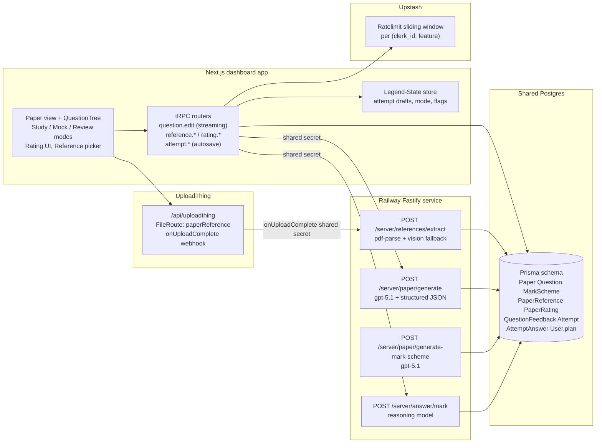

# Exam Genius AI Features Plan

## Architecture

## Stage 0. Foundations (unblocks everything)

**Schema sync.** Canonical schemas stay in [prisma/schemas](prisma/schemas). Add `pnpm sync:schemas` to the frontend that rsyncs `prisma/schemas/`* into the backend (omitting the `generator.output` + `engineType` lines via a sed pass, since backend uses `prisma-client-js` default output). Add a CI job that runs the sync and fails if `git diff` is non-empty.

**Shared-secret auth.** New env `BACKEND_SHARED_SECRET` in both repos. Backend adds a Fastify `preHandler` that 401s any `/server/`* request without `X-Exam-Genius-Secret`. Frontend axios calls in [apps/dashboard-app/src/server/api/routers/paper.ts](apps/dashboard-app/src/server/api/routers/paper.ts) and [apps/dashboard-app/src/server/handlers/stripe-webhook-handlers.ts](apps/dashboard-app/src/server/handlers/stripe-webhook-handlers.ts) attach the header. UploadThing webhook does the same.

**New Prisma models** (added to `prisma/schemas/paper.prisma` and new `prisma/schemas/ai.prisma`):

- `Question` - recursive self-relation via `parent_id`, `label`, `order`, `marks`, `topic`, `body Json` (blocks: text / table / image_placeholder / math), `revision`, timestamps. Relation to `Paper`.
- `QuestionRevision` - audit log of prior `body` + `marks` per question edit.
- `MarkScheme` - 1:1 with `Paper`, `status`, `model_answer Json`, `points Json`, `prompt_version`, timestamps.
- `PaperReference` - `user_id`, `course_id`, `paper_code?`, `kind` enum (`question_paper | mark_scheme | examiner_report`), `ut_key`, `ut_url`, `filename`, `extracted_text`, `text_hash` (SHA-256 for de-dupe), `token_count`, `status`, timestamps.
- `PaperRating` - 1:1 with `Paper`, `stars`, `comment?`, `dimensions Json?`.
- `QuestionFeedback` - `question_id`, `sentiment` (-1/+1), `reason_tags String[]`, `note?`.
- `Attempt` - `attempt_id`, `paper_id`, `user_id`, `mode` (`mock | study`), `started_at`, `submitted_at?`, `time_limit_sec?`, `total_score?`, `total_max?`, `grade_band?`, `status` enum (`in_progress | submitted | marking | marked | failed`).
- `AttemptAnswer` - `attempt_id`, `question_id`, `answer_text`, `score?`, `max_score`, `examiner_note?`, `model_answer_snapshot?`, `prompt_version?`, timestamps. Unique on `(attempt_id, question_id)`.
- Fields on `Paper`: `prompt_version String?`, `model String?`, `generator_version Int @default(1)`, `structured_at DateTime?` (null for legacy HTML-only papers).
- Fields on `User`: `plan String @default("free")`, enum lookup (`free | plus | pro`). Stripe webhook in [apps/dashboard-app/src/server/handlers/stripe-webhook-handlers.ts](apps/dashboard-app/src/server/handlers/stripe-webhook-handlers.ts) writes this from subscription metadata.

**Feature flags.** Add `apps/dashboard-app/src/store/app.store.ts` `flags: { structuredQuestions, questionEdits, paperReferences, aiMarking }` seeded from `NEXT_PUBLIC_`* env vars; default all false in prod until stage-level rollout.

## Stage 1. Structured questions + renderer

**Backend structured output.** Rewrite [exam-genius-backend/src/app/modules/paper/paper.controller.ts](../exam-genius-backend/src/app/modules/paper/paper.controller.ts) to call `openai.chat.completions.create` with `response_format: { type: 'json_schema', json_schema: PaperGenerationResult }`. Schema is recursive `QuestionNode { label, marks, topic, body, children? }`. Validate with zod; one retry on parse fail; persist in a `prisma.$transaction` that writes `Paper.content` (server-rendered HTML for PDF), `Paper.structured_at`, `Paper.prompt_version`, `Paper.model`, plus all `Question` rows. Single shared HTML renderer at `exam-genius-backend/src/app/modules/paper/render.ts`.

**Frontend renderer.** New `apps/dashboard-app/src/components/paper/QuestionTree.tsx` that renders `Question[]` with block-aware rendering, a per-question kebab menu (rating, edit, revision history) and a stable `data-question-id` attribute for selection. `apps/dashboard-app/src/components/paper/PaperView.tsx` wraps it and picks renderer based on `Paper.structured_at`:

- `structured_at != null` -> `QuestionTree`
- else -> current `parse(DOMPurify.sanitize(...))` path
- plus a `SegmentedControl` at the top ("Structured" / "Classic") persisted in `appStore$.reader.rendererMode`. Classic stays the fallback for old papers and the user-preference for those who want the HTML look.

**Lazy parse of legacy papers.** New tRPC mutation `paper.ensureStructured({ paper_id })` that, on first open of a pre-Stage-1 paper, calls a small backend endpoint `POST /server/paper/parse-legacy` which sends the HTML to `gpt-5.1-mini` with the same json_schema and persists `Question[]`. On parse failure, paper stays classic-only; UI tooltip explains.

Carousel in [PaperClient.tsx](apps/dashboard-app/src/app/(dashboard)/course/[course_id]/[unit]/[paper]/PaperClient.tsx) swaps inner render to `PaperView`.

## Stage 2. Per-question edits (Feature 3)

Flag: questionEdits.

**Next.js tRPC** `question.edit` mutation in a new `apps/dashboard-app/src/server/api/routers/question.ts`, using the Vercel AI SDK (`ai` + `@ai-sdk/openai`) and `streamText` through a Next.js Route Handler `apps/dashboard-app/src/app/api/question/edit/route.ts` to enable token streaming. Input: `{ question_id, user_prompt, preset?, preserve_marks: boolean }`. Flow: load question + paper context, compose prompt, stream tokens back, on finalize persist a new `Question` row revision and a `QuestionRevision` audit.

**UI.** Click question block in `QuestionTree` -> Mantine `Drawer` (desktop, side) or bottom sheet (mobile). Shows current body preview, preset chips (`Make harder`, `Make easier`, `Change context`, `Rewrite with cleaner wording`, `Convert to multi-part`), textarea, "Preserve marks" checkbox (default on). Submit streams replacement into an inline preview; on complete, `motion` cross-fade swaps the new body into the tree; 10-second Undo toast writes a revert mutation. Kebab menu -> "Revision history" modal listing `QuestionRevision` rows with "Restore".

## Stage 3. Reference uploads (Feature 1)

Flag: `paperReferences`.

**UploadThing.** Add `apps/dashboard-app/src/app/api/uploadthing/core.ts` defining a single `paperReference` FileRoute: PDF only, 10 MB max, Clerk-gated middleware attaching `userId`, `courseId`, `paperCode?`, `kind`. `onUploadComplete` makes an authenticated POST to backend `POST /server/references/extract` with `{ reference_id, ut_key, ut_url, ... }` and creates the `PaperReference` row in `pending` status.

**Backend extraction.** New module `exam-genius-backend/src/app/modules/reference/` with `reference.controller.ts` + route. Steps: download from `ut_url`, `pdf-parse` for text, if extracted length < 500 chars fall back to `gpt-5.1-mini` vision OCR, compute SHA-256 over text, upsert on `(user_id, text_hash)` to dedupe, update status -> `ready` with `extracted_text` + `token_count`. Log via Logtail.

**Frontend UI.** New `apps/dashboard-app/src/app/(dashboard)/references/page.tsx` listing user references grouped by course; per-item kind, size, pages, apply-scope edit, delete. On the generate-paper button in [course/[course_id]/[unit]/page.tsx](apps/dashboard-app/src/app/(dashboard)/course/[course_id]/[unit]/page.tsx), a "Reference style" popover lets the student toggle which references to use for the next generation (defaults to "all applicable").

**Generator wiring.** When Next.js calls backend `POST /server/paper/generate`, it passes `reference_ids: string[]`. Backend loads their `extracted_text`, budgets total context (cap at 40k input tokens), and injects them as few-shot exemplars in the system prompt.

## Stage 4. Ratings + feedback loop (Feature 2)

**UI.** Per-paper star rating bar + comment at the bottom of a paper view; per-question thumbs + reason-tag chips in the question kebab menu. tRPC: `rating.submitPaper`, `rating.submitQuestion` (upsert).

**Style-context composition.** Backend helper `exam-genius-backend/src/app/modules/paper/style-context.ts` `buildStudentStyleContext({ user_id, course_id, paper_code })` returns:

- `exemplars`: top 2 papers by `PaperRating.stars` in same `(user_id, course_id, paper_code)` within last 30 days, serialised as trimmed `QuestionTree` text.
- `avoid`: aggregated low-rating reason tags from last 10 questions, summarised into 1-2 plain-English directives ("student has flagged recent questions as too easy -> target upper-grade difficulty").

Paper generate + mark-scheme + edit endpoints all pull this helper before prompting.

**Transparency panel.** On the generate screen, a collapsed "What we learned from your feedback" card shows the composed directives in plain English before the student confirms generation.

## Stage 5. Auto mark scheme

Fires automatically after `Paper.status -> success`. Backend generator endpoint on success enqueues (or synchronously fires-and-forgets via `setImmediate`) a second call to `POST /server/paper/generate-mark-scheme` which produces a `MarkScheme` row keyed to `paper_id`. UI: "Mark scheme" button on each question's kebab in Study mode reveals model answer + mark points for that question; a top-level "Show full mark scheme" toggle reveals them all. `Paper.mark_scheme_status` drives a subtle "Mark scheme ready" Mantine notification.

## Stage 6. AI marking + Mock/Review modes

Flag: `aiMarking`.

**Mode selector.** Replace the current unconditional view with a segmented control at the top of `PaperView`: `Study | Mock | Review`. Mode is URL param `?mode=`. Only one `in_progress` `Attempt` per `(user, paper)` (unique partial index).

**Mock mode.** Renders questions without mark scheme; Mantine `Textarea` under each question. A timer in `apps/dashboard-app/src/components/paper/MockTimer.tsx` with pause/resume, countdown computed from `paper.time_limit_sec` (derived from `SUBJECT_PAPERS` config). Autosave: Legend-State holds draft, tRPC `attempt.saveAnswer({ attempt_id, question_id, answer_text })` debounced 1.5s, with optimistic DB write. On "Submit for marking", tRPC `attempt.submit` transitions status to `marking` and enqueues backend call.

**Backend marking.** `POST /server/answer/mark` receives `attempt_id`; loads attempt + paper + mark scheme + all `AttemptAnswer` rows; calls reasoning model with strict json_schema for `{ questions: [{ question_id, score, examiner_note }], grade_band, summary }`. Writes results back; sets `status -> marked`.

**Review mode.** Renders each question with the student answer, score badge, examiner commentary, and a "Reveal model answer" accordion. Overall banner shows total / percentage / grade band / summary.

## Stage 7. Tiers, rate limits, polish

**Upstash Ratelimit.** New `apps/dashboard-app/src/server/ratelimit.ts` exposing `getLimiter(plan, feature)` with prefix `eg:rl:{plan}:{feature}`. Plan map in `apps/dashboard-app/src/server/plans.ts` - all features `unlimited` for `free` today (per your Q7), with commented-out sane caps for later. tRPC middleware `rateLimited(feature)` reads `ctx.user.plan`, calls `ratelimit.limit(ctx.auth.userId)`, throws `TRPCError({ code: 'TOO_MANY_REQUESTS' })` on deny. Applied to `paper.createPaper`, `question.edit`, `reference.upload`, `attempt.submit`, `rating.submitPaper` (trivial). Backend endpoints remain internal (shared secret); limits are enforced at the tRPC boundary.

**Stripe webhook plan sync.** In [stripe-webhook-handlers.ts](apps/dashboard-app/src/server/handlers/stripe-webhook-handlers.ts), on `customer.subscription.`*, map subscription `price_id` -> `plan` via a new `STRIPE_PLAN_MAP` config and write `User.plan`.

**Observability.**

- PostHog events: `paper_generation_started|succeeded|failed`, `question_edit_submitted|succeeded|failed`, `reference_uploaded|extracted|rejected`, `rating_submitted`, `attempt_started|submitted|marked`, all with `paper_id`, `model`, `prompt_version`, `duration_ms`.
- Sentry: wrap `QuestionTree` and the attempt page with error boundaries; tag errors with `paper_id` / `attempt_id`.
- Axiom: backend `generatePaper`, `generateMarkScheme`, `markAttempt`, `extractReference` log structured rows with those same fields.

**Prompt versioning.** Every backend prompt builder lives in `exam-genius-backend/src/app/prompts/*.ts` and exports `{ version, build(...) }`. Generators write `prompt_version` onto the produced row. One place to grep when quality regresses.

## Risks and open items

- Structured output reliability on complex maths / chem notation. Mitigation: the `math` block type stays a string (LaTeX or the existing ad-hoc syntax); we don't try to parse it.
- Reasoning-model cost for AI marking can spike. Mitigation: strict per-attempt token budget and a "marking in progress" UX so students don't re-submit.
- UploadThing + Clerk auth handoff: the `onUploadComplete` callback runs server-side without a cookie; auth is via the middleware's user tag baked into the upload metadata, not via Clerk at webhook time.
- Legacy-paper parse quality will be uneven; we accept that and gate Feature 3 per-paper on parse success.

## Stage ordering and rollout

Stages 0 -> 1 -> 2 -> 3 -> 4 -> 5 -> 6 -> 7. Each stage is independently flag-gated and ships end-to-end (schema + backend + frontend + observability) before moving on. Stage 0 and 1 must land together because the renderer is how every subsequent stage surfaces.