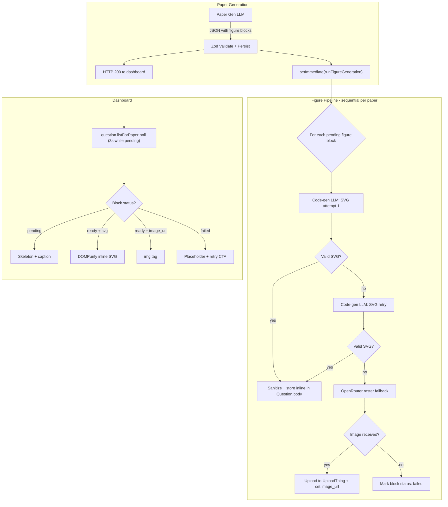

# Async Figure Generation for Exam Papers

Linear issue: [EXAM-6](https://linear.app/examgenius/issue/EXAM-6/epic-async-figure-generation-structured-specs-code-gen-svg-openrouter)

## Architecture Overview



## Decisions Summary

- **Primary rendering**: Dedicated code-gen LLM produces SVG markup from structured figure specs
- **Fallback**: On SVG failure (malformed, nonsensical, timeout) -> retry SVG once -> fallback to raster via OpenRouter image models (configurable chain: `google/gemini-3.1-flash-image-preview`, `bytedance-seed/seedream-4.5`, `openai/gpt-5-image-mini`)
- **Async lifecycle**: `setImmediate` after paper persist (mirroring mark scheme pattern in [paper.controller.ts](exam-genius-backend/src/app/modules/paper/paper.controller.ts) lines 220-225)
- **Storage**: SVG inline in `Question.body` JSON; raster fallback as UploadThing URL
- **Frontend**: DOMPurify-sanitized inline SVG; 3s polling while any figure is pending
- **Model config**: New `LlmModelConfig` DB table replaces all `OPENAI_*_MODEL` env vars; `getModel(key)` helper with 60s in-memory cache; editable via Prisma Studio. `FIGURE_RASTER_MODELS` stays as env var (rarely changed, fast access during fallback).
- **Manual override**: "Replace figure" upload, no mandatory review gate
- **Future**: Explore `QuestionFigure` table for cross-paper figure reuse (not in v1)

---

## Task 1: Extend Block Schema (Backend)

**File**: [exam-genius-backend/src/app/modules/paper/schema.ts](exam-genius-backend/src/app/modules/paper/schema.ts)

Add a new `figure` block kind to the discriminated union at line 3. Keep `image_placeholder` for backward compat.

```typescript
z.object({
  kind: z.literal('figure'),
  caption: z.string(),
  figure_label: z.string().nullable(),
  diagram_type: z.string(),
  elements: z.record(z.string(), z.unknown()),
  render_method: z.enum(['svg_primary', 'raster_fallback', 'manual_upload']).nullable(),
  svg: z.string().nullable(),
  image_url: z.string().nullable(),
  status: z.enum(['pending', 'ready', 'failed']),
  generation_model: z.string().nullable(),
  error_message: z.string().nullable(),
})
```

Also update `structuredBlockSchema` (line 50) to include `figure` in the `kind` enum and add the corresponding nullable fields. Update `structuredBlockToContentBlock` (line 75) to handle the new kind.

---

## Task 2: Update Paper Generation Prompts

**File**: [exam-genius-backend/src/app/prompts/paper-generate.ts](exam-genius-backend/src/app/prompts/paper-generate.ts)

Modify `buildPaperGenerateSystemPrompt` (line 50) to include `figure` in the block type list. Replace the existing `image_placeholder` instruction:

```
{"kind":"figure","caption":"Figure 1","figure_label":"Figure 1",
 "diagram_type":"electrochemical_cell",
 "elements":{"left_electrode":"platinum","right_electrode":"magnesium",
             "left_solution":"1 mol dm^-3 hydrochloric acid",
             "right_solution":"1 mol dm^-3 magnesium chloride solution",
             "bridge":"salt bridge","instrument":"voltmeter",
             "gas_input":"hydrogen"},
 "render_method":null,"svg":null,"image_url":null,
 "status":"pending","generation_model":null,"error_message":null}
```

The prompt should instruct the LLM to:
- Use `figure` blocks instead of `image_placeholder` when a diagram is needed
- Always provide a descriptive `diagram_type` (e.g. `projectile_motion`, `electrochemical_cell`, `force_diagram`, `circuit`, `graph_function`, `bar_chart`, `molecular_structure`)
- Populate `elements` with all labelled components, measurements, and annotations
- Leave `svg`, `image_url`, `render_method`, `generation_model`, `error_message` as null and `status` as `"pending"`

---

## Task 3: Create SVG Renderer Prompt

**New file**: `exam-genius-backend/src/app/prompts/figure-render.ts`

Create a versioned prompt package (`FIGURE_RENDER_PROMPT_VERSION = 'figure_render_v1'`) for the code-gen LLM with:

- System prompt: "You produce SVG markup for UK A-level exam paper diagrams. Output monochrome line art suitable for printing. Use clear labels with leader lines. Use a standard viewBox (e.g. 0 0 600 400). Output ONLY the raw SVG element, no markdown fences."
- User prompt builder: takes `diagram_type`, `elements`, `caption`, and `subject` and formats them into a structured rendering request
- Retry prompt variant: tightened instructions referencing the specific failure reason

---

## Task 4: LLM Model Config Table

### 4a: Prisma model

**File**: [exam-genius-backend/prisma/schemas/ai.prisma](exam-genius-backend/prisma/schemas/ai.prisma)

Add a new model at the end of the file:

```prisma
model LlmModelConfig {
  id          Int      @id @unique @default(autoincrement())
  created_at  DateTime @default(now())
  updated_at  DateTime @updatedAt
  key         String   @unique        // e.g. "paper_generate", "mark_scheme", "legacy_parse", "attempt_marking", "figure_svg"
  model_id    String                  // e.g. "gpt-5-mini", "gpt-4o-mini"
  provider    String   @default("openai") // "openai" | "openrouter" | etc.
  description String?                 // human-readable label for Prisma Studio / admin
  is_active   Boolean  @default(true)
}
```

The `key` column is the lookup key used by services. Having `provider` lets the helper route the call to the correct client (OpenAI vs OpenRouter).

### 4b: Seed data

**File**: new `exam-genius-backend/prisma/seed-llm-models.ts` (or append to existing seed if one exists)

Upsert 5 rows matching today's env var defaults:

- `key: "paper_generate"` / `model_id: "gpt-5-mini"` / `provider: "openai"` / `description: "Paper question generation"`
- `key: "mark_scheme"` / `model_id: "gpt-5-mini"` / `provider: "openai"` / `description: "Mark scheme generation"`
- `key: "legacy_parse"` / `model_id: "gpt-4o-mini"` / `provider: "openai"` / `description: "Legacy HTML paper parsing"`
- `key: "attempt_marking"` / `model_id: "gpt-5-mini"` / `provider: "openai"` / `description: "Student attempt AI marking"`
- `key: "figure_svg"` / `model_id: "gpt-5-mini"` / `provider: "openai"` / `description: "Figure diagram SVG code generation"`

### 4c: Helper with in-memory cache

**New file**: `exam-genius-backend/src/app/utils/llm-model-config.ts`

```typescript
import { prisma } from './prisma';
import { logger } from './logger';

type ModelEntry = { model_id: string; provider: string };

let cache: Map<string, ModelEntry> | null = null;
let cacheLoadedAt = 0;
const CACHE_TTL_MS = 60_000; // refresh from DB every 60 seconds

const DEFAULTS: Record<string, ModelEntry> = {
  paper_generate:  { model_id: 'gpt-5-mini',  provider: 'openai' },
  mark_scheme:     { model_id: 'gpt-5-mini',  provider: 'openai' },
  legacy_parse:    { model_id: 'gpt-4o-mini',  provider: 'openai' },
  attempt_marking: { model_id: 'gpt-5-mini',  provider: 'openai' },
  figure_svg:      { model_id: 'gpt-5-mini',  provider: 'openai' },
};

async function loadCache(): Promise<Map<string, ModelEntry>> {
  const rows = await prisma.llmModelConfig.findMany({ where: { is_active: true } });
  const map = new Map<string, ModelEntry>();
  for (const r of rows) map.set(r.key, { model_id: r.model_id, provider: r.provider });
  return map;
}

export async function getModel(key: string): Promise<ModelEntry> {
  if (!cache || Date.now() - cacheLoadedAt > CACHE_TTL_MS) {
    try {
      cache = await loadCache();
      cacheLoadedAt = Date.now();
    } catch (err) {
      logger.warn('[llm-model-config] cache refresh failed, using stale/defaults', { error: String(err) });
    }
  }
  return cache?.get(key) ?? DEFAULTS[key] ?? { model_id: 'gpt-5-mini', provider: 'openai' };
}

export function invalidateModelCache(): void {
  cache = null;
}
```

Key properties:
- **60s TTL cache** means model changes via Prisma Studio / admin take effect within a minute without a server restart
- **Hardcoded `DEFAULTS`** fallback ensures the system works even if the DB is unreachable or the table is empty (zero-downtime migration)
- `invalidateModelCache()` available for tests or a future admin endpoint

### 4d: Migrate existing env var reads

Replace all current `process.env.OPENAI_*_MODEL` reads with `getModel()` calls:

**[paper.controller.ts](exam-genius-backend/src/app/modules/paper/paper.controller.ts)** line 112:
```typescript
// before
const model = process.env.OPENAI_PAPER_MODEL ?? 'gpt-5-mini';
// after
const { model_id: model } = await getModel('paper_generate');
```

**[paper.controller.ts](exam-genius-backend/src/app/modules/paper/paper.controller.ts)** line 296:
```typescript
// before
const model = process.env.OPENAI_PARSE_MODEL ?? 'gpt-4o-mini';
// after
const { model_id: model } = await getModel('legacy_parse');
```

**[mark-scheme.service.ts](exam-genius-backend/src/app/modules/paper/mark-scheme.service.ts)** line 9:
```typescript
// before (module-level const)
const model = process.env.OPENAI_MARK_SCHEME_MODEL ?? process.env.OPENAI_PAPER_MODEL ?? 'gpt-5-mini';
// after (move inside function body of runMarkSchemeGeneration)
const { model_id: model } = await getModel('mark_scheme');
```

**[marking.service.ts](exam-genius-backend/src/app/modules/answer/marking.service.ts)** line 155:
```typescript
// before
const model = process.env.OPENAI_MARKING_MODEL ?? 'gpt-5-mini';
// after
const { model_id: model } = await getModel('attempt_marking');
```

### 4e: Create OpenRouter Client

**New file**: `exam-genius-backend/src/app/utils/openrouter.ts`

```typescript
import OpenAI from 'openai';

export const openrouter = new OpenAI({
  apiKey: process.env.OPENROUTER_API_KEY,
  baseURL: 'https://openrouter.ai/api/v1',
});
```

`FIGURE_RASTER_MODELS` remains an env var (comma-separated model chain, rarely changed, needs fast access during the fallback loop):
- Default: `google/gemini-3.1-flash-image-preview,bytedance-seed/seedream-4.5,openai/gpt-5-image-mini`

---

## Task 5: Create Figure Render Service

**New file**: `exam-genius-backend/src/app/modules/paper/figure-render.service.ts`

Core service with this flow:

```typescript
export async function runFigureGeneration(paperId: string): Promise<void>
```

**Sequence (sequential per paper):**

1. Load all questions for the paper
2. Scan each question's `body` for blocks with `kind: 'figure'` and `status: 'pending'`
3. For each pending figure block (sequentially):
   a. **SVG attempt 1**: Resolve model via `await getModel('figure_svg')`, call code-gen LLM with figure spec -> validate output
   b. **SVG validation gate**: XML parse check, non-empty `<svg>` root, viewBox present, required labels from `elements` present in SVG text content
   c. On SVG failure: **SVG retry** with tightened prompt including failure reason
   d. On second SVG failure: **Raster fallback** via OpenRouter model chain
   e. On raster success: upload PNG/JPEG buffer to UploadThing, set `image_url` and `render_method: 'raster_fallback'`
   f. On all failures: set `status: 'failed'` with `error_message`
   g. On any success: set `status: 'ready'`, `generation_model`, and either `svg` or `image_url`
4. **Persist**: Read the question's current `body`, patch the specific block by index, write back via `prisma.question.update({ data: { body: updatedBody } })`

**SVG validation function** (separate, testable):

```typescript
function validateSvg(svg: string, expectedLabels: string[]): { valid: boolean; reason?: string }
```

- Parse as XML (use `fast-xml-parser` or DOMParser equivalent)
- Check for `<svg>` root element
- Check viewBox is present and non-zero
- Check each expected label string appears in the SVG text content
- Return structured pass/fail with reason

**Error handling**: Wrap entire function in try/catch. On unhandled error, mark all remaining pending figures as `failed`. Log structured events per figure stage.

---

## Task 6: Wire Up in Paper Controller

**File**: [exam-genius-backend/src/app/modules/paper/paper.controller.ts](exam-genius-backend/src/app/modules/paper/paper.controller.ts)

After the existing `setImmediate` for mark scheme (line 220), add a second `setImmediate` for figure generation:

```typescript
setImmediate(() => {
  logger.debug('[paper.generate] figures_scheduled', { paper_id: paper.paper_id });
  void runFigureGeneration(paper.paper_id).catch(err =>
    logger.error('[paper.generate] figures_async_error', { paper_id: paper.paper_id, error: String(err) })
  );
});
```

Also add an HTTP endpoint for manual re-trigger (mirroring `generateMarkSchemeHttp` at line 378):

```typescript
export async function generateFiguresHttp(req: FastifyRequest, reply: FastifyReply): Promise<void>
```

Register the new route in [server-routes.ts](exam-genius-backend/src/app/modules/server-routes.ts).

---

## Task 7: HTML Renderer Update

**File**: [exam-genius-backend/src/app/modules/paper/render.ts](exam-genius-backend/src/app/modules/paper/render.ts)

Update `renderBlockToHtml` (line 12) to handle the `figure` block kind:

- If `status === 'ready'` and `svg` is present: render the raw SVG inline
- If `status === 'ready'` and `image_url` is present: render ``
- Otherwise: fall back to the existing `[Figure: caption]` placeholder pattern

---

## Task 8: Frontend BlockView Update

**File**: [exam-genius/apps/dashboard-app/src/components/paper/QuestionTree.tsx](apps/dashboard-app/src/components/paper/QuestionTree.tsx)

Update `BlockView` function (line 44) to handle `figure` blocks:

```typescript
case 'figure': {
  if (b.status === 'ready' && b.svg) {
    const clean = DOMPurify.sanitize(b.svg, { USE_PROFILES: { svg: true, svgFilters: true } });
    return (
      <div className="eg-figure my-4" dangerouslySetInnerHTML={{ __html: clean }} />
    );
  }
  if (b.status === 'ready' && b.image_url) {
    return ;
  }
  if (b.status === 'failed') {
    return (
      <Box className="eg-figure-failed border rounded p-4 my-4 text-center">
        <Text size="sm" c="dimmed">[Figure: {b.caption}]</Text>
        <Text size="xs" c="red">Figure generation failed</Text>
        <Button size="xs" variant="light" mt="xs">Retry</Button>
      </Box>
    );
  }
  // pending
  return (
    <Skeleton height={200} className="my-4" />
  );
}
```

Install `dompurify` and `@types/dompurify` in the dashboard app.

---

## Task 9: Frontend Polling for Figures

**File**: [exam-genius/apps/dashboard-app/src/components/paper/PaperBody.tsx](apps/dashboard-app/src/components/paper/PaperBody.tsx)

Modify the `question.listForPaper` query (line 70) to add conditional polling when any figure block is pending:

```typescript
const hasPendingFigures = questions.some(q =>
  Array.isArray(q.body) && (q.body as any[]).some(
    b => b.kind === 'figure' && b.status === 'pending'
  )
);

const { data: questions = [], refetch: refetchQuestions } = api.question.listForPaper.useQuery(
  { paperId: paper.paper_id },
  {
    enabled: /* existing condition */,
    refetchInterval: hasPendingFigures ? 3000 : false,
  }
);
```

Add an alert similar to the mark scheme pending alert (line 268) when figures are generating:

```
"Diagrams are being generated and will appear automatically in a moment."
```

---

## Task 10: Manual Figure Replace

**Backend**: Add a `POST /server/paper/replace-figure` endpoint that accepts `question_id`, `block_index`, and either a file upload or UploadThing URL. Updates the specific block in `Question.body` with `render_method: 'manual_upload'`, `image_url`, `status: 'ready'`.

**Frontend**: Add an upload button on each figure block (ready or failed state) that calls the replace endpoint. Reuse the UploadThing pattern from the existing reference upload in [uploadthing/core.ts](apps/dashboard-app/src/app/api/uploadthing/core.ts).

---

## Task 11: Observability + Stale Recovery

**Backend**: Add structured logs (`logAiStructured`) per figure stage: `figure_svg_attempt`, `figure_svg_success`, `figure_svg_fail`, `figure_raster_attempt`, `figure_raster_success`, `figure_raster_fail`.

Add a stale figure recovery sweep (mirroring `scheduleStaleMarkingRecovery` in main.ts) that periodically checks for questions with `figure` blocks stuck in `pending` status beyond a timeout threshold and marks them as `failed`.

---

## Dependencies to Install

**Backend** (`exam-genius-backend`):
- `fast-xml-parser` (SVG validation)

**Dashboard** (`exam-genius/apps/dashboard-app`):
- `dompurify` + `@types/dompurify` (SVG sanitization)

---

## Files Changed Summary

**Backend (new files)**:
- `src/app/prompts/figure-render.ts`
- `src/app/utils/openrouter.ts`
- `src/app/utils/llm-model-config.ts`
- `src/app/modules/paper/figure-render.service.ts`
- `src/app/modules/paper/svg-validator.ts`
- `prisma/seed-llm-models.ts`

**Backend (modified files)**:
- `prisma/schemas/ai.prisma` — new `LlmModelConfig` model
- `src/app/modules/paper/schema.ts` — new `figure` block kind
- `src/app/prompts/paper-generate.ts` — updated system prompt
- `src/app/modules/paper/paper.controller.ts` — wire up figure generation + HTTP trigger; replace env var model reads with `getModel()`
- `src/app/modules/paper/mark-scheme.service.ts` — replace env var model read with `getModel()`
- `src/app/modules/answer/marking.service.ts` — replace env var model read with `getModel()`
- `src/app/modules/paper/render.ts` — handle `figure` in HTML rendering
- `src/app/modules/server-routes.ts` — register new routes
- `src/main.ts` — stale figure recovery

**Dashboard (modified files)**:
- `apps/dashboard-app/src/components/paper/QuestionTree.tsx` — `figure` block rendering
- `apps/dashboard-app/src/components/paper/PaperBody.tsx` — figure polling + pending alert
- `apps/dashboard-app/src/app/api/uploadthing/core.ts` — figure replace upload route (if needed)
